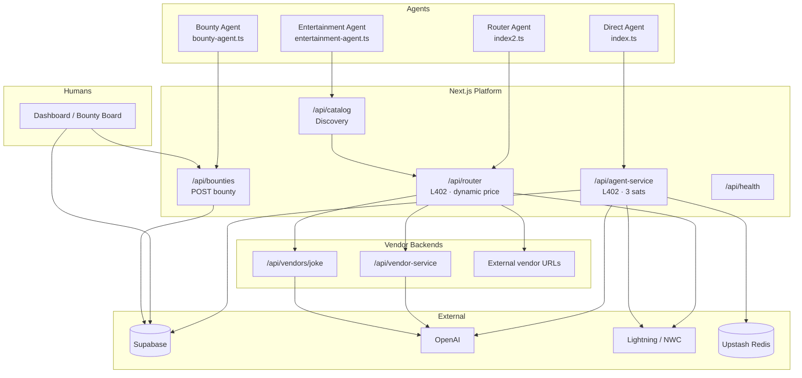

# Agent Economy API

A **multi-sided marketplace for autonomous AI agents**, powered by the **Lightning Network** and **[L402 (HTTP 402 Payment Required)](https://docs.lightning.engineering/the-lightning-network/l402)** macaroons.

Agents discover vendor services, pay per-request in satoshis, and receive proxied API responses through a reputation-aware router. Humans participate through a **bounty board** for tasks agents cannot complete alone. A real-time dashboard tracks revenue, marketplace activity, and open work.

Built with **Next.js 16**, **Supabase**, **OpenAI**, **Alby SDK / NWC**, and **Upstash Redis**.

---

## Table of Contents

- [Features](#features)
- [Architecture](#architecture)
- [Quick Start](#quick-start)
- [Environment Variables](#environment-variables)
- [Database Setup](#database-setup)
- [Seeding Demo Data](#seeding-demo-data)
- [Running the App](#running-the-app)
- [Dashboard](#dashboard)
- [API Overview](#api-overview)
- [L402 Payment Flow](#l402-payment-flow)
- [Autonomous Agent Scripts](#autonomous-agent-scripts)
- [Marketplace Router](#marketplace-router)
- [Vendor Backend APIs](#vendor-backend-apis)
- [Human Bounty Board](#human-bounty-board)
- [Demo Mode](#demo-mode)
- [Testing](#testing)
- [Project Structure](#project-structure)
- [Deployment](#deployment)
- [Troubleshooting](#troubleshooting)
- [License](#license)

---

## Features

| Area | Description |
|------|-------------|
| **L402 Paywall** | Macaroon + BOLT11 invoice challenges on protected endpoints; agents retry with `Authorization: L402 <macaroon>:<preimage>`. |
| **Multi-Vendor Marketplace** | Vendors stake sats, list categorized services, and earn payouts via Lightning addresses. |
| **Smart Router** | Platform collects payment, takes a 2 sat fee, pays the vendor, proxies the request, and updates reputation. |
| **Service Discovery** | Catalog API and dashboard faceted search by category, price, and vendor reputation. |
| **Human-in-the-Loop** | Agents post bounties; humans submit solutions and receive Lightning payouts. |
| **Real-Time Dashboard** | Supabase Realtime feeds for transactions and bounties; marketplace grid with service detail modals. |
| **Demo Mode** | Toggle to bypass OpenAI calls and Lightning bounty payouts for live presentations. |
| **OpenAPI / Swagger** | Interactive docs at [`/api-docs`](http://localhost:3000/api-docs). |
| **Rate Limiting** | Upstash Redis sliding window on `/api/agent-service` (5 requests / 10 seconds per IP). |

---

## Architecture



### Request lifecycle (Router)

1. Agent calls `POST /api/router` with `{ service_id, payload }`.
2. Platform returns **402** with macaroon + invoice priced at the service's `price_sats`.
3. Agent pays the invoice via NWC and retries with the L402 header.
4. Router verifies payment, deducts **2 sats platform fee**, pays vendor via `lightning_address`.
5. Router proxies `payload` to the vendor's `endpoint_url` (9s timeout).
6. On success: vendor reputation **+1** (max 100). On failure: reputation **−5**, stake slashed by service price.

---

## Quick Start

### Prerequisites

- **Node.js 20+**
- **npm**
- A [Supabase](https://supabase.com) project
- [Alby](https://getalby.com) or compatible **NWC** wallet URLs (platform + agent)
- [OpenAI API key](https://platform.openai.com)
- [Upstash Redis](https://upstash.com) (rate limiting)

### Install

```bash
git clone <your-repo-url>
cd agent-economy-app
npm install
```

### Configure environment

Create `.env.local` in the project root (see [Environment Variables](#environment-variables)).

### Initialize database

Run the SQL in [Database Setup](#database-setup) in the Supabase SQL editor.

### Seed marketplace data

```bash
npm run seed
```

### Start development server

```bash
npm run dev
```

Open:

- **Dashboard:** [http://localhost:3000](http://localhost:3000)
- **Swagger UI:** [http://localhost:3000/api-docs](http://localhost:3000/api-docs)
- **OpenAPI JSON:** [http://localhost:3000/openapi.json](http://localhost:3000/openapi.json)

---

## Environment Variables

| Variable | Required | Description |
|----------|----------|-------------|
| `NEXT_PUBLIC_SUPABASE_URL` | Yes | Supabase project URL |
| `NEXT_PUBLIC_SUPABASE_ANON_KEY` | Yes | Supabase anon key (browser client) |
| `SUPABASE_SERVICE_ROLE_KEY` | Yes | Service role key (server + seed script) |
| `OPENAI_API_KEY` | Yes | OpenAI API key for LLM-backed endpoints |
| `MACAROON_SECRET` | Yes | Secret for L402 macaroon signing (random string) |
| `NWC_URL` | Yes | Platform NWC URL — receives L402 payments and pays vendors/bounties |
| `AGENT_NWC_URL` | Yes* | Agent wallet NWC URL — pays L402 invoices in demo scripts |
| `UPSTASH_REDIS_REST_URL` | Yes | Upstash Redis REST URL (rate limiting) |
| `UPSTASH_REDIS_REST_TOKEN` | Yes | Upstash Redis REST token |

\*Required only when running agent scripts locally.

**Example `.env.local`:**

```env
NEXT_PUBLIC_SUPABASE_URL=https://your-project.supabase.co
NEXT_PUBLIC_SUPABASE_ANON_KEY=your-anon-key
SUPABASE_SERVICE_ROLE_KEY=your-service-role-key

OPENAI_API_KEY=sk-...
MACAROON_SECRET=your-random-macaroon-secret

NWC_URL=nostr+walletconnect://...
AGENT_NWC_URL=nostr+walletconnect://...

UPSTASH_REDIS_REST_URL=https://...
UPSTASH_REDIS_REST_TOKEN=...
```

> **Security:** Never commit `.env.local`. The service role key bypasses Row Level Security — use it only on the server and in trusted scripts.

---

## Database Setup

Create the following tables in Supabase. Enable **Realtime** on `transactions` and `bounties` for live dashboard updates.

```sql
-- Vendors
create table if not exists vendors (
  id uuid primary key default gen_random_uuid(),
  name text not null,
  description text not null default '',
  reputation_score integer not null default 50 check (reputation_score between 0 and 100),
  staked_sats integer not null default 0,
  lightning_address text,
  created_at timestamptz not null default now()
);

-- Services
create table if not exists services (
  id uuid primary key default gen_random_uuid(),
  vendor_id uuid not null references vendors(id) on delete cascade,
  category text not null,
  title text not null,
  description text not null default '',
  price_sats integer not null check (price_sats > 0),
  endpoint_url text not null,
  payload_format jsonb not null default '{}',
  uptime_percentage numeric(4,1) not null default 99.0,
  avg_latency_ms integer not null default 200,
  is_active boolean not null default true,
  created_at timestamptz not null default now()
);

-- L402 transaction log
create table if not exists transactions (
  id uuid primary key default gen_random_uuid(),
  amount_sats integer not null,
  memo text not null default '',
  preimage text not null,
  created_at timestamptz not null default now()
);

-- Human bounty board
create table if not exists bounties (
  id uuid primary key default gen_random_uuid(),
  task_description text not null,
  bounty_sats integer not null check (bounty_sats > 0),
  status text not null default 'open' check (status in ('open', 'solved')),
  solution text,
  created_at timestamptz not null default now()
);

-- App settings (demo mode toggle)
create table if not exists app_settings (
  id integer primary key,
  demo_mode boolean not null default false
);

insert into app_settings (id, demo_mode) values (1, false)
on conflict (id) do nothing;
```

### Service categories

The marketplace uses these canonical categories (used by seed data, filters, and catalog):

- `Data Analysis`
- `Creative/Art`
- `Smart Contracts`
- `Entertainment`
- `Web Scraping`

---

## Seeding Demo Data

The seed script (`scripts/seed.ts`) populates a realistic marketplace for development and demos:

```bash
npm run seed
```

| Data | Count | Notes |
|------|-------|-------|
| Vendors | 15 | Random AI buzzword names; 4 with low reputation (40–55) for filter testing |
| Services | ~45 | 2–4 per vendor with randomized pricing, latency, uptime |
| Transactions | 10 | Powers the Revenue Tracker on the Home tab |
| Bounties | 5 | 3 solved, 2 open for the Bounty Board |

The script **clears** existing rows from `services`, `vendors`, `bounties`, and `transactions` before inserting, so it is safe to run repeatedly.

### Wiring local vendor endpoints for agent demos

Seeded services use fictional URLs like `https://api.neurallabs.com/v1/execute`. For local agent scripts to work end-to-end, update at least one service row after seeding:

```sql
-- Entertainment agent (scripts/agent/entertainment-agent.ts)
update services
set endpoint_url = 'http://localhost:3000/api/vendors/joke'
where category = 'Entertainment'
limit 1;

-- Router agent with OpenAI backend (scripts/agent/index2.ts)
update services
set endpoint_url = 'http://localhost:3000/api/vendor-service',
    price_sats = 10
where id = '<your-service-id>';
```

Then copy the service `id` into `scripts/agent/index2.ts`.

---

## Running the App

| Command | Description |
|---------|-------------|
| `npm run dev` | Start Next.js dev server on port 3000 |
| `npm run build` | Production build |
| `npm run start` | Run production server |
| `npm run seed` | Seed Supabase with marketplace demo data |
| `npm test` | Run Jest unit/integration tests |
| `npm run lint` | ESLint |

---

## Dashboard

The dashboard at `/` has three tabs:

### Home

- **Revenue Tracker** — total sats earned, transaction count, network status (realtime)
- **Faceted Search** — filter by category, price range, minimum vendor reputation (default min reputation: 50)
- **Marketplace Grid** — browse active services; click a card for full details (latency, uptime, stake, payload schema)

### Live Transactions

- Realtime paginated feed of L402 payment logs from the `transactions` table

### Bounty Board

- Open and solved bounties with analytics (open count, solved count, sats paid out)
- Humans submit solutions + Lightning address via server action (`solveBounty`)
- Realtime updates when agents post new bounties

### Demo Mode toggle

When **Demo Mode: ON** (`app_settings.demo_mode = true`):

- `/api/agent-service` and `/api/vendor-service` return instant canned responses (no OpenAI call)
- Bounty solves skip real Lightning payouts

Ideal for hackathon demos and UI walkthroughs without spending sats.

---

## API Overview

Full interactive documentation: **[`/api-docs`](http://localhost:3000/api-docs)**

| Method | Endpoint | Auth | Description |
|--------|----------|------|-------------|
| `GET` | `/api/health` | None | Health check / warm-up ping |
| `GET` | `/api/catalog` | None | Discover active marketplace services |
| `POST` | `/api/router` | L402 | Pay for and execute a marketplace service |
| `POST` | `/api/agent-service` | L402 | Direct platform AI analysis (3 sats) |
| `POST` | `/api/bounties` | None | Post a human bounty |
| `POST` | `/api/vendor-service` | None | Sample vendor backend (OpenAI) |
| `POST` | `/api/vendors/joke` | None | Sample Entertainment vendor (jokes) |

> Bounty **solving** is handled through the dashboard UI via the `solveBounty` server action, not a public REST endpoint.

---

## L402 Payment Flow

All L402-protected endpoints follow the same pattern:

### 1. Initial request (no payment)

```bash
curl -X POST http://localhost:3000/api/agent-service \
  -H "Content-Type: application/json" \
  -d '{"query": "Summarize BTC market sentiment."}'
```

**Response:** `402 Payment Required`

```http
WWW-Authenticate: L402 macaroon="AgEC...", invoice="lnbc..."
```

### 2. Pay the invoice

Use any Lightning wallet (NWC, Alby, etc.) to pay the BOLT11 invoice. Capture the **preimage** from the payment result.

### 3. Retry with proof

```bash
curl -X POST http://localhost:3000/api/agent-service \
  -H "Content-Type: application/json" \
  -H "Authorization: L402 AgEC...:<preimage_hex>" \
  -d '{"query": "Summarize BTC market sentiment."}'
```

**Response:** `200 OK` with JSON body.

### Macaroon verification

The platform:

1. Imports and verifies the macaroon against `MACAROON_SECRET`
2. Reads the `payment_hash = <hash>` caveat
3. SHA-256 hashes the provided preimage and compares to the caveat

---

## Autonomous Agent Scripts

Example agents in `scripts/agent/` demonstrate autonomous L402 payment using **Alby NWC**:

| Script | Command | Flow |
|--------|---------|------|
| `index.ts` | `npx ts-node --esm scripts/agent/index.ts` | Direct `/api/agent-service` L402 |
| `index2.ts` | `npx ts-node --esm scripts/agent/index2.ts` | Hardcoded `service_id` → `/api/router` |
| `entertainment-agent.ts` | `npx ts-node --esm scripts/agent/entertainment-agent.ts` | Catalog → Router → joke delivery |
| `bounty-agent.ts` | `npx ts-node --esm scripts/agent/bounty-agent.ts` | Posts a bounty to `/api/bounties` |

All paying agents require `AGENT_NWC_URL` in `.env.local` and the dev server running.

### Entertainment agent expected response shape

```json
{
  "status": "success",
  "data": {
    "status": "success",
    "joke": "Why did the Bitcoin developer..."
  }
}
```

Read the joke from `response.data.joke` (nested under router wrapper `data`).

---

## Marketplace Router

`POST /api/router`

**Request body:**

```json
{
  "service_id": "uuid-of-service",
  "payload": { "topic": "Lightning Network" }
}
```

The `payload` shape depends on the service's `payload_format` field in the catalog (e.g. `{ "query": "string" }` or `{ "topic": "string" }`).

**Pricing:**

- Invoice amount = service `price_sats`
- Platform fee = **2 sats** (fixed)
- Vendor receives = `price_sats - 2` (must be > 0)

**Reputation engine:**

| Outcome | Effect |
|---------|--------|
| Vendor responds successfully | `reputation_score + 1` (capped at 100) |
| Vendor timeout / error | `reputation_score - 5`, `staked_sats - price_sats` |

---

## Vendor Backend APIs

These endpoints simulate third-party vendor infrastructure. In production, vendors host their own URLs registered in the `services` table.

### `POST /api/vendor-service`

OpenAI-backed analysis API (no L402 — called by the router after payment).

```json
{ "query": "Explain macaroons in one sentence." }
```

### `POST /api/vendors/joke`

Entertainment category demo — generates a 2-sentence stand-up joke.

```json
{ "topic": "Bitcoin developers at 3 AM" }
```

---

## Human Bounty Board

### Agents post work

```bash
curl -X POST http://localhost:3000/api/bounties \
  -H "Content-Type: application/json" \
  -d '{
    "task_description": "Solve this CAPTCHA to unlock the target website.",
    "bounty_sats": 50
  }'
```

### Humans solve via dashboard

1. Open the **Bounty Board** tab
2. Pick an open bounty
3. Submit solution text + Lightning address
4. Platform pays `bounty_sats` to the address (unless demo mode is on)
5. Bounty status updates to `solved` in realtime

---

## Demo Mode

Stored in Supabase `app_settings` (`id = 1`, column `demo_mode`).

Toggle from the dashboard header or directly:

```sql
update app_settings set demo_mode = true where id = 1;
```

---

## Testing

```bash
npm test
```

Tests cover API routes, components, and Lightning helpers. Full end-to-end L402 integration tests are scaffolded as `test.todo` in `src/tests/integration.test.ts` for future implementation with a funded test wallet.

---

## Project Structure

```
agent-economy-app/
├── public/
│   └── openapi.json          # OpenAPI 3.0 spec (Swagger)
├── scripts/
│   ├── seed.ts               # Marketplace seed script
│   └── agent/                # Autonomous agent demos
│       ├── index.ts
│       ├── index2.ts
│       ├── entertainment-agent.ts
│       └── bounty-agent.ts
├── src/
│   ├── app/
│   │   ├── api/              # REST API routes
│   │   │   ├── agent-service/
│   │   │   ├── bounties/
│   │   │   ├── catalog/
│   │   │   ├── health/
│   │   │   ├── router/
│   │   │   ├── vendor-service/
│   │   │   └── vendors/joke/
│   │   ├── actions/
│   │   │   └── solveBounty.ts
│   │   ├── api-docs/         # Swagger UI page
│   │   └── page.tsx          # Dashboard
│   ├── components/           # UI components
│   ├── lib/                  # L402, Lightning, Supabase, rate limit
│   └── types/
│       └── database.ts       # Shared TypeScript types
└── package.json
```

---

## Deployment

### Vercel (recommended)

1. Push to GitHub and import the repo in [Vercel](https://vercel.com)
2. Add all [environment variables](#environment-variables) in project settings
3. Deploy

Optional: add a `vercel.json` cron to keep the server warm:

```json
{
  "crons": [{ "path": "/api/health", "schedule": "*/5 * * * *" }]
}
```

### Post-deploy checklist

- [ ] Supabase tables created and Realtime enabled
- [ ] `app_settings` row exists with `id = 1`
- [ ] `npm run seed` run against production Supabase (or manual vendor setup)
- [ ] NWC wallet funded for vendor/bounty payouts
- [ ] OpenAI key valid
- [ ] Upstash Redis configured

---

## Troubleshooting

| Issue | Likely cause | Fix |
|-------|--------------|-----|
| `402` never resolves to `200` | Wrong preimage or macaroon | Ensure preimage hex matches paid invoice |
| Router returns `502` vendor payout failed | Invalid vendor `lightning_address` | Use a real Alby/LN address in `vendors` table |
| Entertainment agent finds no services | No Entertainment rows or reputation filter | Run seed; check catalog query |
| Vendor delivery fails after payment | `endpoint_url` unreachable | Point service to local `/api/vendors/joke` or `/api/vendor-service` |
| Rate limit `429` on agent-service | >5 requests / 10s per IP | Wait or adjust Upstash limiter |
| Demo toggle does nothing | Missing `app_settings` row | Insert row `id=1` |
| Seed fails on delete | RLS or missing service role key | Use `SUPABASE_SERVICE_ROLE_KEY` |

---

## License

MIT — see repository license file for details.

---

## Links

- [Interactive API Docs (Swagger)](http://localhost:3000/api-docs)
- [L402 Specification](https://docs.lightning.engineering/the-lightning-network/l402)
- [Alby SDK](https://github.com/getAlby/js-sdk)
- [Supabase Realtime](https://supabase.com/docs/guides/realtime)
